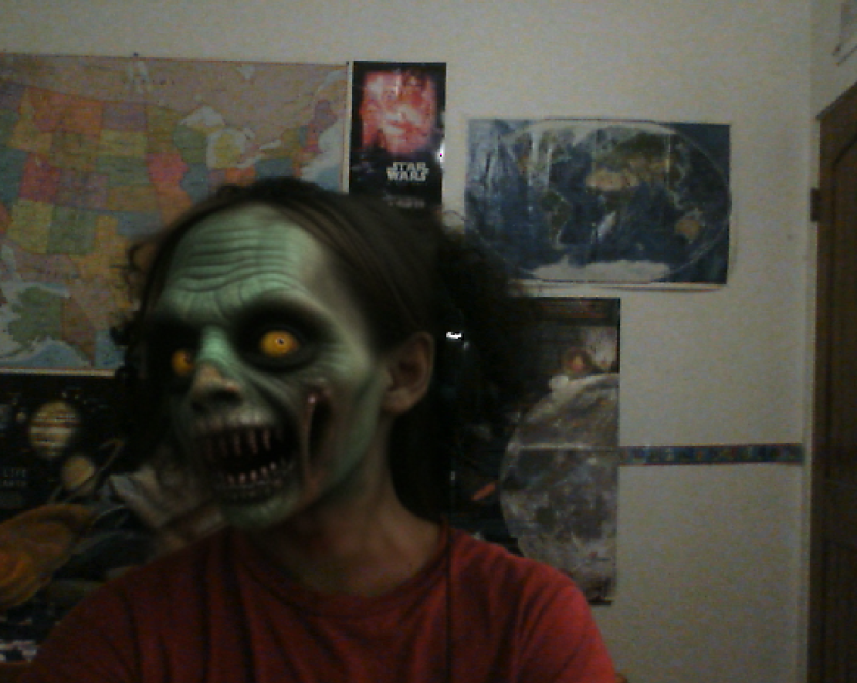
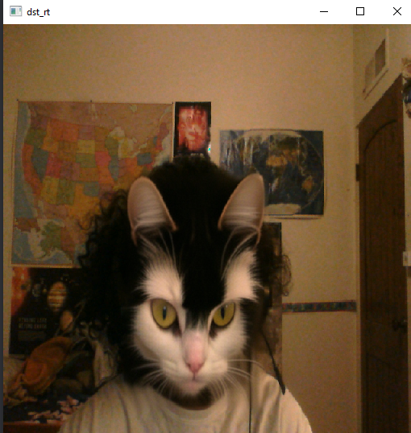

# firebird-fiesta
This code applies a stable diffusion face filter onto whatever is in view of your webcam. It works by finding all the regions of your webcam that contain a face through Yolo V8, and then applies a face filter onto the face region that takes up the most space.

Note: The code assumes you're not running stable diffusion locally, and are instead using a shared AUTOMATIC 111 Stable Diffusion Web UI Gradio link.
You must provide the link in the args when executing the python file. 

